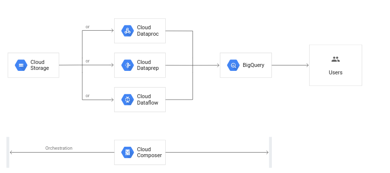

# Set_up_production_Development_data_pipelines_on_google_cloud

Set up a data lake for data manipulation

GCP offers flexible and scallable for big data analytics and Ml solutions

We are going to take advantage of Data lake

  A data lake is usually a single store of all enterprise data including raw copies of source system data and transformed data used for tasks such as reporting, visualization, advanced analytics and machine learning
  
  The [Cloud Storage as a data lake](https://cloud.google.com/solutions/build-a-data-lake-on-gcp) 
    -Our solution ismainly focussed at data processing and visualization
    
       ### Data ingestion
           - Our data is mainly in csv format from client. Schedule data transfer from remote to the cloud storage repository 
           
           - The data wiill reside on the cloud storage bucket
           
  The data ingestion will mainly be done using [gsutil](https://cloud.google.com/storage/docs/gsutil)
           
           
    ###Processing and analytics
       -store everything now so that you can extract insights later. Depending on the nature of the raw data and the types of analytics involved. The workflow we are designing is a simple pipeline and gradually expand it with time

       
       
       
       

    
